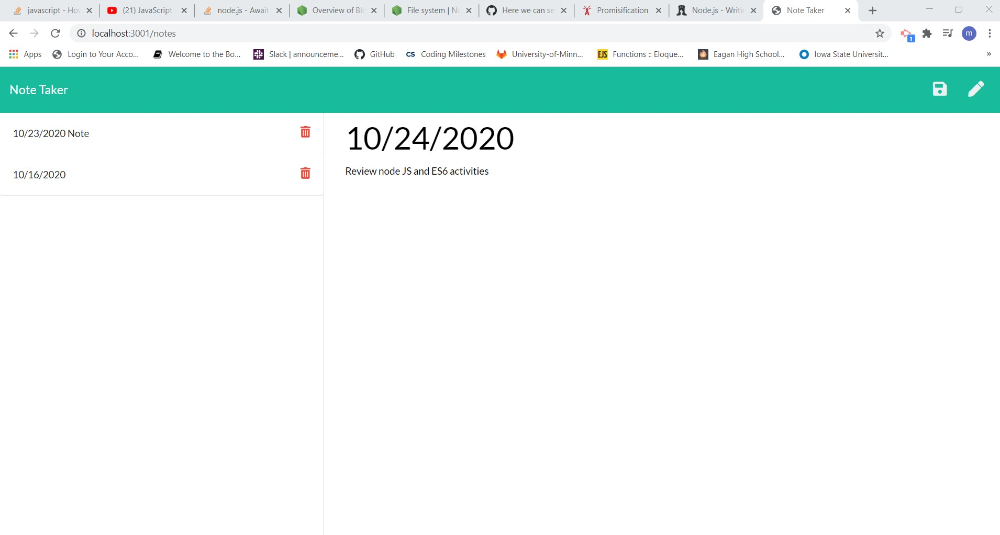
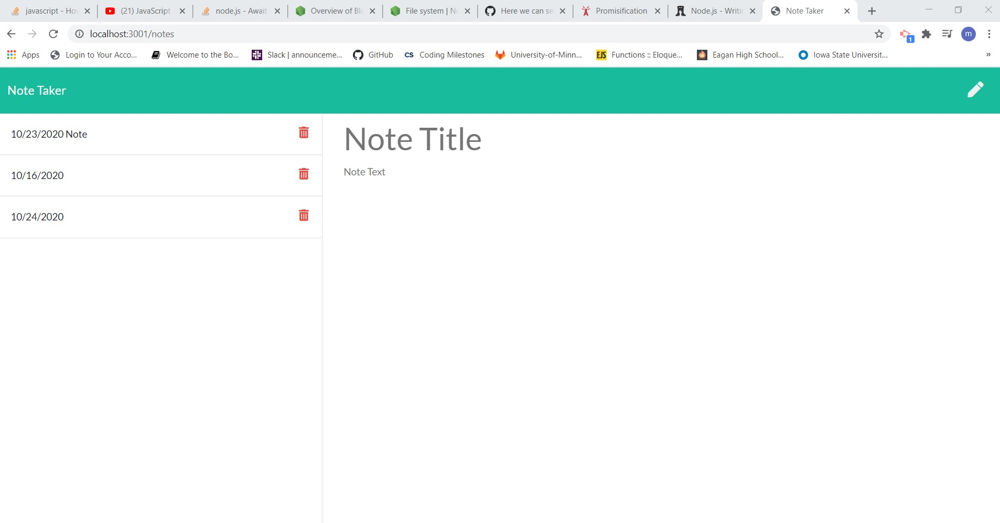
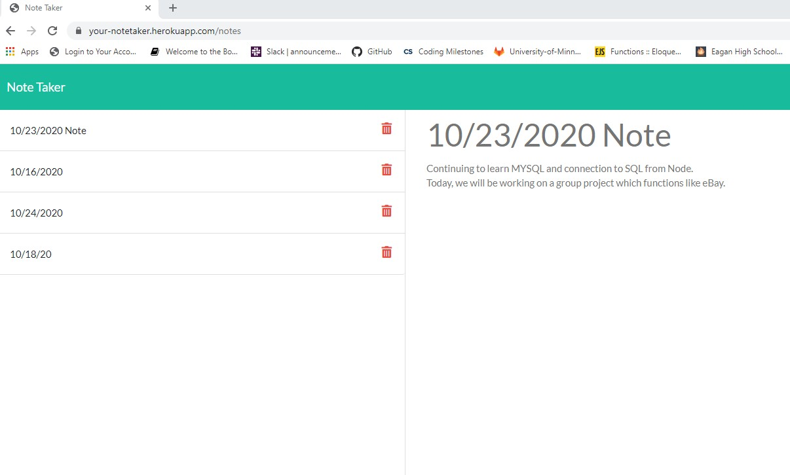
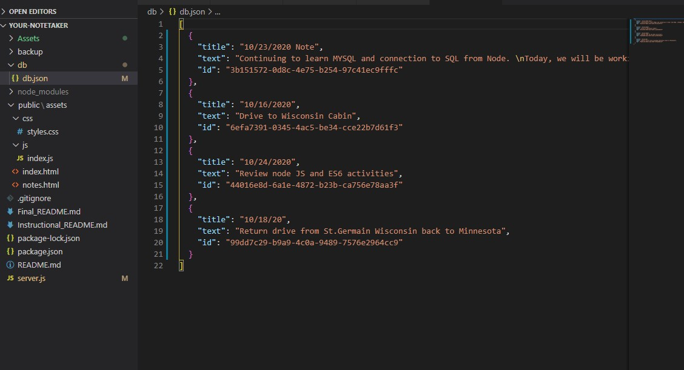

# Your_NoteTaker
## Table of contents

1. [Description](#description)

2. [Install Guide](#install)

3. [Usage](#usage)

4. [Contribute](#contribute)

5. [license](#license)

6. [Screenshots](#images)

7. [URL](#url)
        
<div id="description"/>
        
## Description
```
This Application can be used to write, save, and delete notes. The data is saved to the a file in JSON format, so that it can be retrieved for viewing.
This application gives opportunity for the user to organize their thoughts and keep track of their tasks that they need to complete.
```
        
<div id="install"/>
        
## Installation Instruction
```
This application is dependent on Node JS installation. Within NodeJS, it requires installation of "express" package for server side api request handling.
It requires "util" package to promisify writeFile. It requires "uuid" package to generate a random id to attach to each notes, to be able to retrieve and delete the notes as necessary.
```
        
<div id="usage"/>
        
## Usage
```
The application is hosted by heroku. When the app URL is clicked, user will be taken to the homepage. User should be able to get to the notes html page, but clicking "Get Started" button. When they are taken to the Notes Page, any notes saved earlier will also be displayed. User can click on any of the saved notes, to review their notes. The user also can click on the delete icon, to delete any notes. To add new notes, User can start typing their Notes Title and the Note Text in the textarea provided for that and click on the save icon. They can click the 'Note Taker' link in the Navigation bar to go back to home page.
```
        
<div id="contribute"/>
        
## How to Contribute
```
1. Fork the repo to GitHub
2. Clone the project to your own machine
3. Commit and push changes to your own branch
4. Push your work back up to your fork
5. Submit a Pull request so that we can review your changes

Note: Be sure to merge the latest from "upstream" before making a pull request!
```
        
<div id="license"/>
        
## License
```
Unlicense
```
        
<div id="images"/>
        
## Screenshots:


View of entry of a new Note for 10/24/20:
----------------------------------------


View of entry of the saved Note for 10/24/20:
----------------------------------------------



View of retrieved notes saved before:
---------------------------------------------



View of notes saved in file in JSON format:
---------------------------------------------


        
        
<div id="url"/>
        
## URL

GitHub Repository: [[https://github.com/meenaambalam/your-notetaker]](https://github.com/meenaambalam/your-notetaker)

Application URL : [[https://your-notetaker.herokuapp.com/]](https://your-notetaker.herokuapp.com/)

